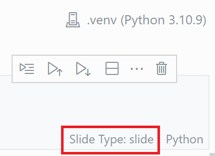

# Jupyter Slide Show support in VS Code

This extension provides support for adding slide types to notebook cells for working with tools like [`nbconvert`](https://github.com/jupyter/nbconvert) to help easily convert your `.ipynb` file into a slide show. Supported slide types are:

Support for additional and more flexible cell tagging is provided by the [Jupyter Cell Tags](https://marketplace.visualstudio.com/items?itemName=ms-toolsai.vscode-jupyter-cell-tags) extension.

### Features:
- Add a slide type to the cell you're on by opening the Command Palette (`Cmd+Shift+P`) and selecting **Switch Slide Type**
- Modify slide types for notebook cells by selecting the slide type on the cell 
- Add or modify slide type for multiple cells by editing the notebook's metadata (JSON format) by opening the Command Palette (`Cmd+Shift+P`) and selecting **Edit Slide Type (JSON)**

### Usage:
After assigning slide types to your cells, create an HTML slideshow presentation by opening the integrated terminal and running the command, `jupyter nbconvert '<notebook-file-name>.ipynb' --to slides --post serve`.

This extension comes with the [Jupyter extension for Visual Studio Code](https://marketplace.visualstudio.com/items?itemName=ms-toolsai.jupyter) and can be disabled or uninstalled.

## Contributing

This project welcomes contributions and suggestions.  Most contributions require you to agree to a
Contributor License Agreement (CLA) declaring that you have the right to, and actually do, grant us
the rights to use your contribution. For details, visit https://cla.opensource.microsoft.com.

When you submit a pull request, a CLA bot will automatically determine whether you need to provide
a CLA and decorate the PR appropriately (e.g., status check, comment). Simply follow the instructions
provided by the bot. You will only need to do this once across all repos using our CLA.

This project has adopted the [Microsoft Open Source Code of Conduct](https://opensource.microsoft.com/codeofconduct/).
For more information see the [Code of Conduct FAQ](https://opensource.microsoft.com/codeofconduct/faq/) or
contact [opencode@microsoft.com](mailto:opencode@microsoft.com) with any additional questions or comments.

## Trademarks

This project may contain trademarks or logos for projects, products, or services. Authorized use of Microsoft 
trademarks or logos is subject to and must follow 
[Microsoft's Trademark & Brand Guidelines](https://www.microsoft.com/en-us/legal/intellectualproperty/trademarks/usage/general).
Use of Microsoft trademarks or logos in modified versions of this project must not cause confusion or imply Microsoft sponsorship.
Any use of third-party trademarks or logos are subject to those third-party's policies.
